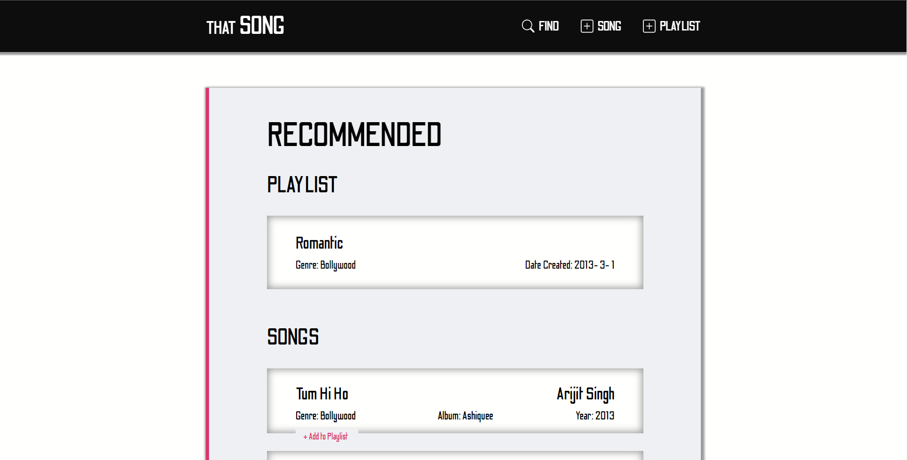
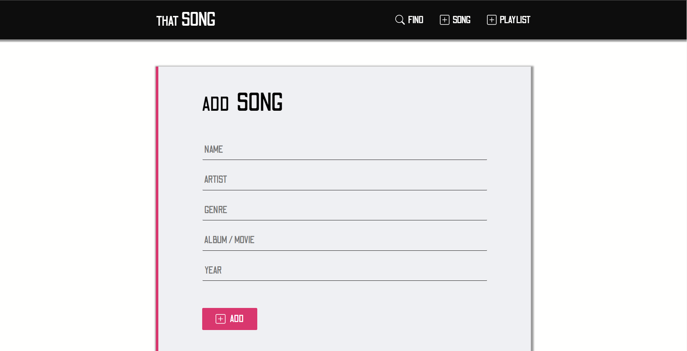
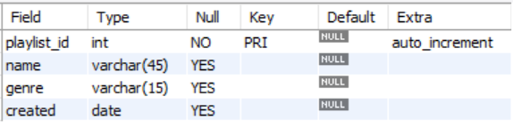
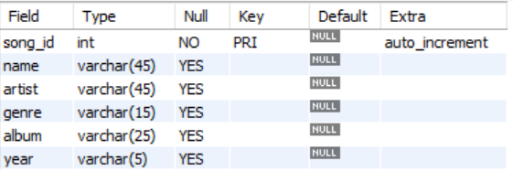
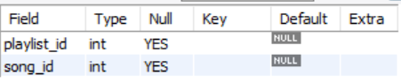
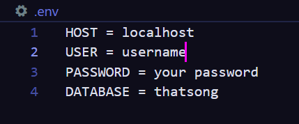

# that-song

This is a simple app which helps to keep record of songs and playlist. And also you can listen the songs on Youtube.

It contains all the CRUD functions ie. we can create, read, update and delete recroding according to our needs.

    
      
    

<h3>Techs used :</h3>

<h6>Front End</h6>
<ul> 
    <li>HTML</li>
    <li>CSS</li>
    <li>JavaScript</li>
</ul>
<h6>Back End</h6>
<ul>
    <li>Node.js</li>
    <li>Express.js</li>
    <li>My SQL</li>
</ul>

<h3>Dependencies :</h3>
<ul>
  <li>express</li>
  <li>ejs</li>
  <li>express-ejs-layouts</li>
  <li>mysql</li>
</ul>

<h3>How to set up this project in your local environment: </h3>
<ul>
    <li>Clone this project in your local computer</li>
    <li>In your CLI run npm install</li>
    <li>Create a database (My SQL) with name thatsong</li>
    <li>In that database create tables - </li>
    <ul>
        <li>playlists : </li>
        <li>songs : </li>
        <li>playlist_songs : </li>
    </ul>
    <li>And last create a ".env" file in your root directory and include - </li>
    <li></li>
</ul>